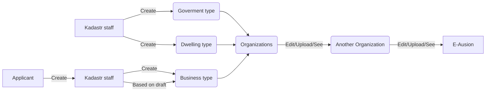

  

# ek-admin-api-gateway

  

  

<br  />

<p  align="center">

  

<a  href="https://chegirma_api_gateway"></a>

  

<h3  align="center">Ekadastr Admin Api Gateway </h3>

<p  align="center">

<br  />

<a  href="https://chegirma_api_gateway"><strong>Explore the docs »</strong></a>

  

<br  />

<a  href="https://admin.ekadastr.udevs.io/">View Demo</a>

<a  href="https://chegirma_api_gateway/issues">Report Bug</a>

  

<a  href="https://chegirma_api_gateway/issues">Request Feature</a>

  

<!-- TABLE OF CONTENTS -->

<details  open="open">

  

<summary>Table of Contents</summary>

  

<ol>

  

<li><a  href="#about-the-project">About The Project</a></li>

<li><a  href="#getting-started">Getting Started</a><ul>

<li><a  href="#prerequisites">Prerequisites</a></li>

<li><a  href="#installation">Installation</a></li>

<li><a  href="#contact">Contact</a></li>

<li><a  href="#global">Global Variables</a></li>

</ol>

  

</details>

  

  

<!-- ABOUT THE PROJECT -->

  

## About The Project

  

This is a government project which is being develeped by Udevs team. Please, If you join this project, make sure that you follow these rules:

  

* Your time should be focused on creating something amazing. A project that solves a problem and helps others

* You shouldn't be doing the same tasks over and over.

  

* You should element DRY principles to the rest of your life :smile:

  

Of course, no one template will serve all projects since your needs may be different. Thanks to all the people have have contributed to expanding this project!

  

<!-- GETTING STARTED -->

  

## Getting Started

  
  

This is an example of how you may give instructions on setting up your project locally.

  

To get a local copy up and running follow these simple example steps.


  
  

### Prerequisites

  

This is an example of how to list things you need to use the software and how to install them.

  

  

*  [Golang](https://golang.org/)
* [MongoDB](https://www.mongodb.com/)

### Installation


1. Clone the repo

  

```sh
git clone https://chegirma_api_gateway.git
```

If you run code locally please, make sure that you have golang version 1.15 or above. Besides that, please make sure mongodb running on your local machine on default port.

  

2. In order to run locally

  

```sh
go run cmd/main.go
```


  
## Global

  

Global variables please, make sure you get to know about the flow:

 On every service we have two submodule:
 
  *  [ek_protos](https://gitlab.udevs.io/ekadastr/ek_protos)
  > This is for grpc proto files all service protos in one file as a submodule in all services.
* [ek_variables](https://gitlab.udevs.io/ekadastr/ek_variables)
> This is for global variables for all service type structres and swagger documentation, please, if you want to change it, make sure you have your own branch, ```Do not change without permission on master branch``` in one file as a submodule in all services.


And this business a flow chart:

  



  

## Contributing

  

Contributions are what make the open source community such an amazing place to be learn, inspire, and create. Any contributions you make are **highly appreciated**.

  

1. Fork the Project

  

2. Create your Feature Branch (`git checkout -b feature/AmazingFeature`)

  

3. Commit your Changes (`git commit -m 'Add some AmazingFeature'`)

  

4. Push to the Branch (`git push origin feature/AmazingFeature`)

  

5. Open a Pull Request

  
  

<!-- CONTACT -->

  

## Contact

  

  

Dilmurod Yangiboev - [@icon_me](dilmurod.yangiboev@gmail.com) - dilmurod.yangiboev@gmail.com

  

Project Link: [https://chegirma_api_gateway](https://chegirma_api_gateway)

  
