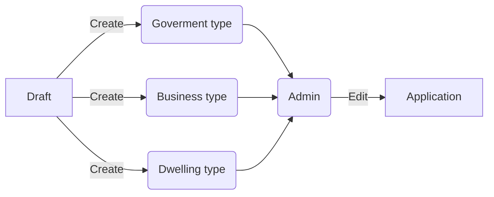

# ek-admin-api-gateway

  

<br  />

<p  align="center">

<a  href="https://gitlab.udevs.io/ekadastr/ek_admin_api_gateway"></a>

<h3  align="center">Ekadastr Admin Api Gateway</h3>
  
<p  align="center">
A golang admin api gateway
<br  />
<a  href="https://gitlab.udevs.io/ekadastr/ek_admin_api_gateway"><strong>Explore the docs »</strong></a>

<br  />
<a  href="https://gitlab.udevs.io/ekadastr/ek_admin_api_gateway">View Demo</a>
<a  href="https://gitlab.udevs.io/ekadastr/ek_admin_api_gateway/issues">Report Bug</a>

<a  href="https://gitlab.udevs.io/ekadastr/ek_admin_api_gateway/issues">Request Feature</a>

<!-- TABLE OF CONTENTS -->
<details  open="open">

<summary>Table of Contents</summary>

<ol>

<li><a  href="#about-the-project">About The Project</a></li>
<li><a  href="#getting-started">Getting Started</a><ul>
<li><a  href="#prerequisites">Prerequisites</a></li>
<li><a  href="#installation">Installation</a></li>
<li><a  href="#contact">Contact</a></li>
<li><a  href="#global">Global Variables</a></li>
</ol>

</details>

  
  
  

<!-- ABOUT THE PROJECT -->

## About The Project

Here's why:

* Your time should be focused on creating something amazing. A project that solves a problem and helps others
  
* You shouldn't be doing the same tasks over and over.

* You should element DRY principles to the rest of your life :smile:

Of course, no one template will serve all projects since your needs may be different. So I'll be adding more in the near future. Thanks to all the people have have contributed to expanding this project!

<!-- GETTING STARTED -->

## Getting Started


This is an example of how you may give instructions on setting up your project locally.

To get a local copy up and running follow these simple example steps.


### Prerequisites

This is an example of how to list things you need to use the software and how to install them.

  

*  [Golang](https://golang.org/)
   
### Installation

1. Clone the repo

```sh

git clone https://gitlab.udevs.io/ekadastr/ek_admin_api_gateway.git

```
If you run code locally please, make sure that you have golang version 1.15

2. In order to run locally

```sh
go run cmd/main.go
```

if you have done all well, you can see the documentation on your local machine so click -> [local](http://localhost:8000/swagger/index.html)

<!-- USAGE EXAMPLES -->

<!-- CONTRIBUTING -->

## Contributing
  

Contributions are what make the open source community such an amazing place to be learn, inspire, and create. Any contributions you make are **highly appreciated**.
  

1. Fork the Project

2. Create your Feature Branch (`git checkout -b feature/AmazingFeature`)

3. Commit your Changes (`git commit -m 'Add some AmazingFeature'`)

4. Push to the Branch (`git push origin feature/AmazingFeature`)

5. Open a Pull Request


<!-- CONTACT -->

## Contact

  

 Dilmurod Yangiboev - [@icon_me](dilmurod.yangiboev@gmail.com) - dilmurod.yangiboev@gmail.com

Project Link: [https://gitlab.udevs.io/ekadastr/ek_admin_api_gateway](https://gitlab.udevs.io/ekadastr/ek_admin_api_gateway)

## Global

Global variables please, make sure you get to know about the flow:

|                |Application types              | Code                     |
|----------------|-------------------------------|--------------------------|
|Business        |`business`            		 |3            				|
|Dwelling        |`dwelling`            	     |2 			            |
|Government      |`goverment`			  		 |1							|
	

And this business a flow chart:

